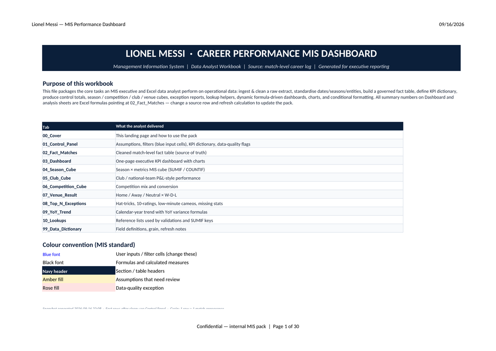
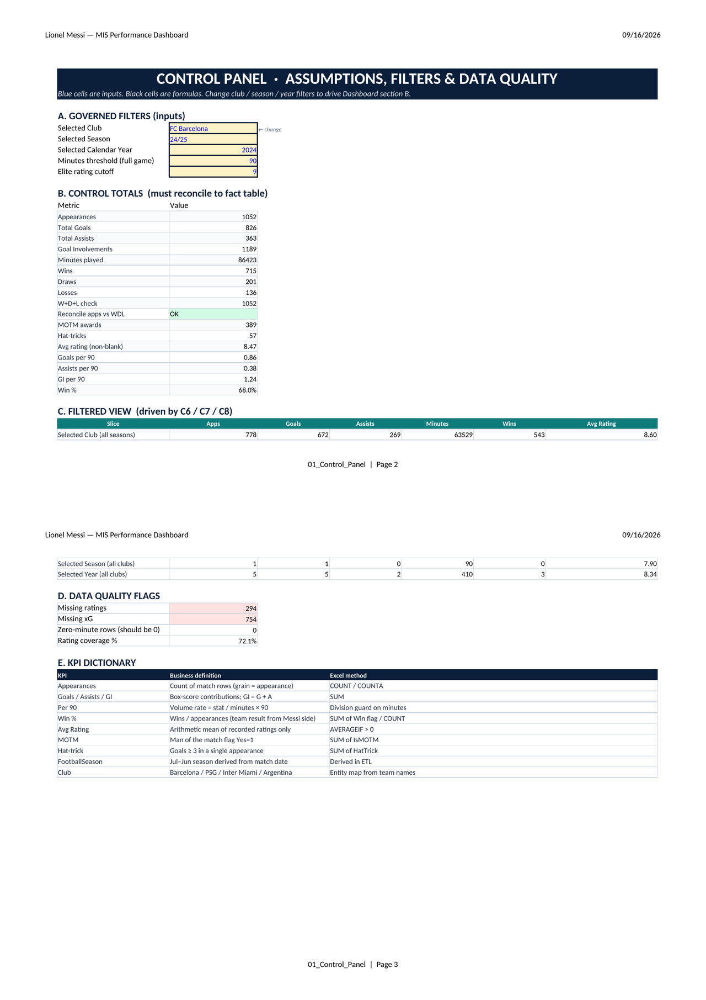
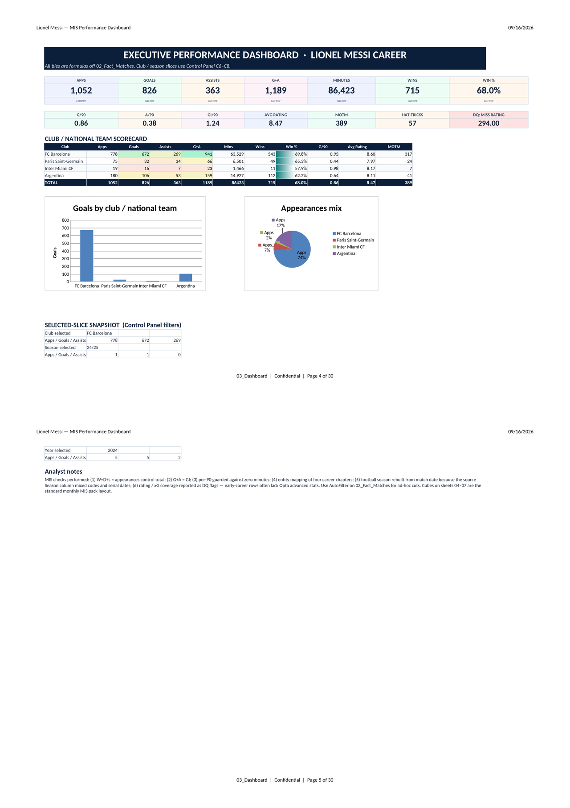
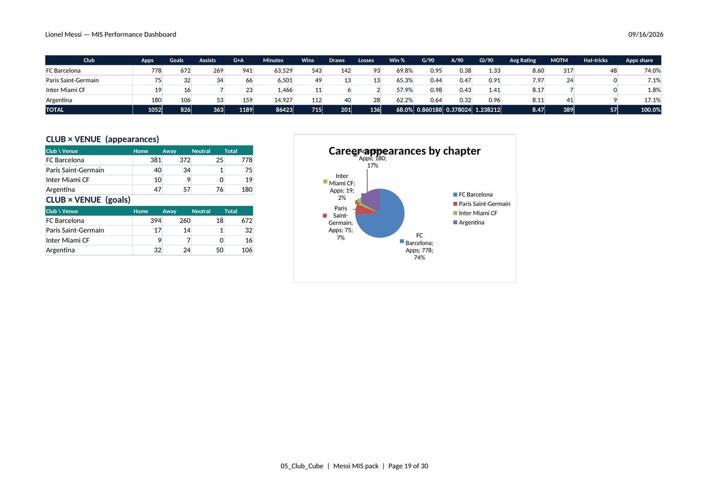
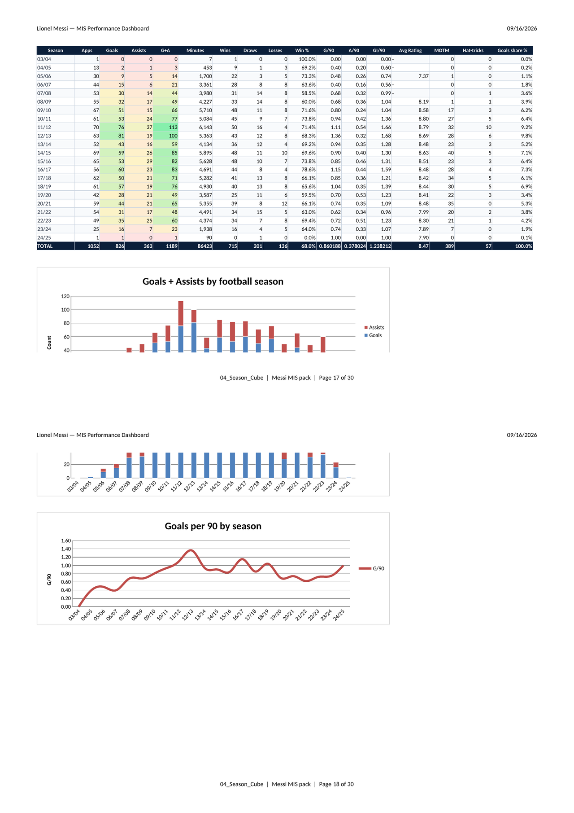
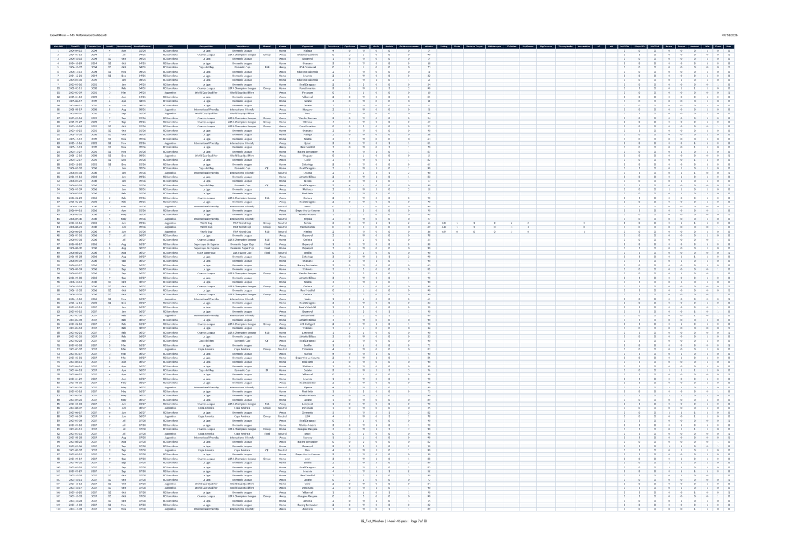
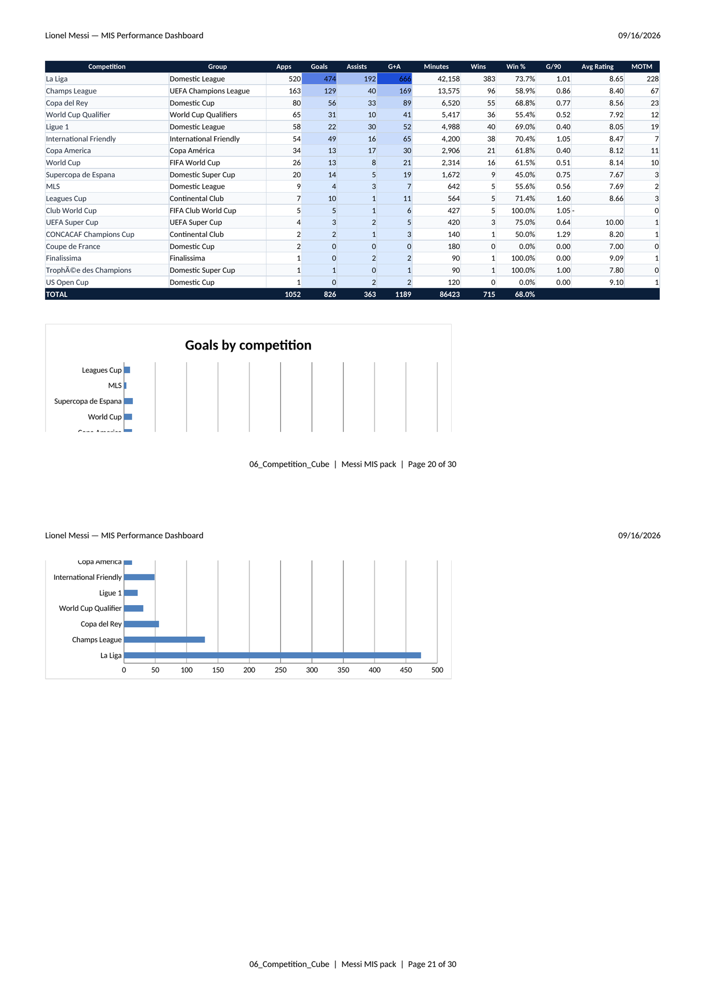

# Messi Career Performance MIS

Excel Management Information System workbook for **Lionel Messi’s career match log** — a governed fact table, control-panel filters, formula-driven executive dashboard, and standard MIS cubes (season / club / competition / venue), plus exception and YoY packs.

Built for hiring managers reviewing **MIS / Data Analyst / Excel reporting** portfolios: open the file, change a blue filter cell, and watch control totals and dashboard slices update.

| Artifact | Path |
|---|---|
| Workbook | [`Messi_Career_Performance_MIS.xlsx`](./Messi_Career_Performance_MIS.xlsx) |
| Demo video (silent) | [`artifacts/messi-career-mis-demo.mp4`](./artifacts/messi-career-mis-demo.mp4) |
| Screenshots | [`screenshots/`](./screenshots/) |

> Open in **Microsoft Excel** (desktop or Microsoft 365) or **LibreOffice Calc**. Enable calculation so SUMIF / COUNTIF / AVERAGEIF tiles refresh. Grain: **1 row = 1 match appearance**.

---

## Business Problem

Career and performance reporting often lives in messy extracts: mixed date formats, inconsistent season codes, incomplete ratings/xG, and entity names that do not align to career chapters. Executives still need **one pack** that:

1. Reconciles control totals (apps = W+D+L),
2. Surfaces career KPIs and club scorecards,
3. Lets analysts slice by club / season / calendar year without rebuilding pivots every month,
4. Flags data-quality gaps (missing ratings, sparse xG) so decisions are not made on silent blanks.

This workbook is that monthly MIS pack, applied to a full career match log.

---

## Workbook Overview

- **Source of truth:** `02_Fact_Matches` — cleaned match-level fact (1,052 appearances).
- **Governance:** `01_Control_Panel` — blue input cells (club, season, year, thresholds), control totals, KPI dictionary, DQ flags.
- **Executive view:** `03_Dashboard` — formula tiles + club scorecard + selected-slice snapshot.
- **Cubes:** Season, Club, Competition, Venue × result — classic SUMIF / COUNTIF layout.
- **Exceptions & trend:** Top-N (hat-tricks, elite ratings, low-minute cameos) and calendar-year YoY.
- **Documentation:** Lookups + Data Dictionary with refresh notes.

**Tools:** Microsoft Excel (formulas, AutoFilter, conditional formatting). No external BI tool required to use the pack.

---

## Key Metrics

Verified from the Dashboard / Control Panel (career, all clubs):

| KPI | Value |
|---|---|
| Appearances | **1,052** |
| Goals | **826** |
| Assists | **363** |
| Goal involvements (G+A) | **1,189** |
| Minutes played | **86,423** |
| Wins / Win % | **715** / **68.0%** |
| Goals per 90 | **0.86** |
| Assists per 90 | **0.38** |
| GI per 90 | **1.24** |
| Avg rating (non-blank) | **8.47** |
| Man of the Match | **389** |
| Hat-tricks | **57** |

**Club chapter (sample):** FC Barcelona **778** apps / **672** goals / **269** assists · PSG 75 / 32 / 34 · Inter Miami 19 / 16 / 7 · Argentina 180 / 106 / 53.

---

## Sheets

### Cover

Landing page with purpose, sheet map, and MIS colour convention (blue = inputs, black = formulas, navy headers, amber assumptions, rose DQ).

**Insights**
- Positions the file as an executive reporting pack, not a raw dump.
- Colour convention matches standard finance/MIS workbooks so reviewers know what is safe to edit.
- States grain and snapshot metadata up front for auditability.

### Control Panel

Governed filters in blue cells (**C6** Selected Club, **C7** Season, **C8** Calendar Year, plus minutes / elite-rating thresholds). Control totals must reconcile to the fact table; DQ flags call out missing ratings and xG.

**Insights**
- Changing **C6–C8** drives the filtered view (section C) and the Dashboard selected-slice snapshot.
- **W+D+L check = Appearances** with an explicit **OK** reconcile flag — classic MIS control total.
- Rating coverage (~72%) and missing xG are reported so sparse advanced stats do not silently bias averages.

### Dashboard

One-page executive view: career KPI tiles, rate metrics (G/90, A/90, GI/90), club/national-team scorecard, filter-driven snapshot, and goals-by-club chart source.

**Insights**
- Barcelona carries ~74% of appearances and the bulk of goals; Inter Miami shows the highest GI/90 on a small sample — rate metrics stay guarded by minutes.
- Selected-slice panel proves filters are live (e.g. club = Barcelona → 778 / 672 / 269).
- DQ tile (miss rating = 294) keeps data quality on the same page as performance.

### Club Cube

Club / national-team P&L-style performance plus Club × Venue crosstabs for appearances and goals.

**Insights**
- Barcelona home goals (394) exceed away (260); Argentina’s neutral load (76 apps) reflects tournament football.
- PSG assists nearly match goals — creator-role shift vs Barcelona volume scoring.
- Apps share column makes chapter mix visible without a separate pivot.

### Season Cube

Football seasons (Jul–Jun) rebuilt from match date because the source Season field mixed codes and serial dates.

**Insights**
- Peak volume: **11/12** — 76 goals, 37 assists, 113 G+A in 70 apps.
- Peak rate: **12/13** — 81 goals, **1.36 G/90**.
- High win-% volume season: **16/17** at 78.6%.

### Fact Matches (sample)

Cleaned fact table — use AutoFilter for ad-hoc cuts; cubes and dashboard all point here.

### Competition Cube

Competition mix with Apps / Goals / Assists / G+A rates and a **Goals by competition** bar chart (La Liga dominates volume).

**Insights**
- Domestic league volume (La Liga) drives career goal totals; Champions League is the next major club competition.
- Cups and internationals show lower absolute goals but remain material for narrative context.
- TOTAL row reconciles to career control totals (1,052 apps / 826 goals).

---

## How to Use

1. Open `Messi_Career_Performance_MIS.xlsx` in Excel (or LibreOffice Calc).
2. Go to **01_Control_Panel**.
3. Edit the **blue** cells:
   - **C6** — Selected Club (e.g. FC Barcelona, Paris Saint-Germain, Inter Miami CF, Argentina)
   - **C7** — Selected Season (e.g. `11/12`, `24/25`)
   - **C8** — Selected Calendar Year (e.g. `2024`)
4. Confirm section B control totals still show **Reconcile = OK**.
5. Open **03_Dashboard** — career tiles stay career-wide; the selected-slice snapshot and filtered view reflect C6–C8.
6. Browse **04_Season_Cube** / **05_Club_Cube** / **06_Competition_Cube** / **07_Venue_Result** for the standard MIS cube pack.
7. Use **08_Top_N_Exceptions** and **09_YoY_Trend** for exception and trend review.
8. For ad-hoc analysis, AutoFilter **02_Fact_Matches** (do not overwrite black-font formula columns on summary sheets).

### Demo walkthrough

Silent Excel-shell walkthrough with **sheet-tab clicks** and **page scrolling** (Cover → Control Panel → Dashboard → Club Cube → **Competition Cube** → Season Cube → Fact sample → Dashboard):

[`artifacts/messi-career-mis-demo.mp4`](./artifacts/messi-career-mis-demo.mp4)

---

## Sheet map (full)

| Sheet | Role |
|---|---|
| `00_Cover` | Landing page & colour convention |
| `01_Control_Panel` | Filters, control totals, KPI dictionary, DQ |
| `02_Fact_Matches` | Cleaned match-level fact (1,052 rows) |
| `03_Dashboard` | Executive KPI dashboard |
| `04_Season_Cube` | Season × metrics |
| `05_Club_Cube` | Club / NT performance + venue cross |
| `06_Competition_Cube` | Competition mix |
| `07_Venue_Result` | Home / Away / Neutral × W-D-L |
| `08_Top_N_Exceptions` | Hat-tricks, elite ratings, cameos, gaps |
| `09_YoY_Trend` | Calendar-year trend + YoY variance |
| `10_Lookups` | Reference lists for validations / keys |
| `99_Data_Dictionary` | Field definitions & refresh notes |

---

## Author

**Nishant Tyagi**  
Excel MIS / Data Analyst portfolio piece — Lionel Messi career performance reporting pack.
